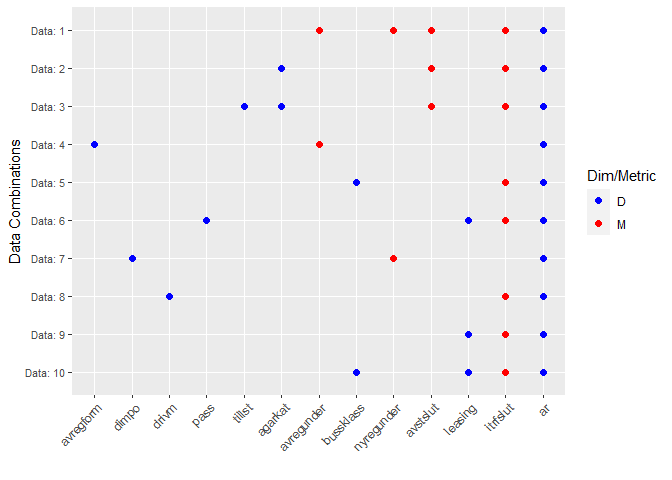

<!-- README.md is generated from README.Rmd. Please edit that file -->

# trafikanalysR

<!-- badges: start -->
<!-- badges: end -->

-   The goal of trafikanalysR is to make Trafikanalys’ API
    (<http://api.trafa.se/api/data?query=>) more accessible.

-   API documentation: <https://www.trafa.se/sidor/api-dokumentation/>

-   Trafikanalys’ page: <https://www.trafa.se/>

## Installation

Development version from [GitHub](https://github.com/) with:

``` r
# install.packages("devtools")
devtools::install_github("JohanSalomonssonSV/trafikanalysR")
```

## Example

Getting variables in each of the data combinations in data table
*bussarT10011*:

``` r
library(trafikanalysR)

ow_bussarT10011("http://api.trafa.se/api/data?query=")
#> 
#> -- Column specification --------------------------------------------------------
#> cols(
#>   Short = col_double(),
#>   Code_snippet = col_character()
#> )
#>          Name               Var_desc Type     DATA InData
#> 1          ar                     År    D  Data: 1      1
#> 2  avregunder Antal avregistreringar    M  Data: 1      1
#> 3    avstslut        Antal avställda    M  Data: 1      1
#> 4    itrfslut         Antal i trafik    M  Data: 1      1
#> 5  nyregunder Antal nyregistreringar    M  Data: 1      1
#> 6     agarkat           Ägarkategori    D  Data: 2      1
#> 7          ar                     År    D  Data: 2      1
#> 8    avstslut        Antal avställda    M  Data: 2      1
#> 9    itrfslut         Antal i trafik    M  Data: 2      1
#> 10    agarkat           Ägarkategori    D  Data: 3      1
#> 11     tillst              Tillstånd    D  Data: 3      1
#> 12         ar                     År    D  Data: 3      1
#> 13   avstslut        Antal avställda    M  Data: 3      1
#> 14   itrfslut         Antal i trafik    M  Data: 3      1
#> 15         ar                     År    D  Data: 4      1
#> 16  avregform   Avregistreringsorsak    D  Data: 4      1
#> 17 avregunder Antal avregistreringar    M  Data: 4      1
#> 18         ar                     År    D  Data: 5      1
#> 19  bussklass              Bussklass    D  Data: 5      1
#> 20   itrfslut         Antal i trafik    M  Data: 5      1
#> 21         ar                     År    D  Data: 6      1
#> 22    leasing                Leasing    D  Data: 6      1
#> 23       pass      Antal passagerare    D  Data: 6      1
#> 24   itrfslut         Antal i trafik    M  Data: 6      1
#> 25         ar                     År    D  Data: 7      1
#> 26      dimpo          Direkt import    D  Data: 7      1
#> 27 nyregunder Antal nyregistreringar    M  Data: 7      1
#> 28         ar                     År    D  Data: 8      1
#> 29      drivm              Drivmedel    D  Data: 8      1
#> 30   itrfslut         Antal i trafik    M  Data: 8      1
#> 31         ar                     År    D  Data: 9      1
#> 32    leasing                Leasing    D  Data: 9      1
#> 33   itrfslut         Antal i trafik    M  Data: 9      1
#> 34         ar                     År    D Data: 10      1
#> 35  bussklass              Bussklass    D Data: 10      1
#> 36    leasing                Leasing    D Data: 10      1
#> 37   itrfslut         Antal i trafik    M Data: 10      1
```

Plotting data combinations and variable availability within each set:

``` r
ow_plot(ow_bussarT10011("http://api.trafa.se/api/data?query="))
#> 
#> -- Column specification --------------------------------------------------------
#> cols(
#>   Short = col_double(),
#>   Code_snippet = col_character()
#> )
```



Fetching Data 1 in *bussarT10011*:

``` r
fetch_bussarT10011("http://api.trafa.se/api/data?query=", 1)
#> 
#> -- Column specification --------------------------------------------------------
#> cols(
#>   Short = col_double(),
#>   Code_snippet = col_character()
#> )
#> # A tibble: 20 x 6
#>    IsTotal ar    avregunder avstslut itrfslut nyregunder
#>    <chr>   <chr>      <dbl>    <dbl>    <dbl>      <dbl>
#>  1 FALSE   2001        1084     4707    14246       1187
#>  2 FALSE   2002        1476     4558    14013       1230
#>  3 FALSE   2003         897     5038    13742       1187
#>  4 FALSE   2004         924     5540    13363       1172
#>  5 FALSE   2005         887     5731    13477       1252
#>  6 FALSE   2006        1285     5686    13643       1465
#>  7 FALSE   2007        1582     5371    13315       1051
#>  8 FALSE   2008         996     5385    13474       1262
#>  9 FALSE   2009         907     5604    13407       1225
#> 10 FALSE   2010        1079     5665    13873       1742
#> 11 FALSE   2011         897     6229    13947       1663
#> 12 FALSE   2012        1349     6215    14203       1712
#> 13 FALSE   2013        1930     5685    13986       1323
#> 14 FALSE   2014        1094     5870    13992       1414
#> 15 FALSE   2015        1474     5633    14114       1423
#> 16 FALSE   2016        1246     5923    13890       1382
#> 17 FALSE   2017        1089     5627    14421       1373
#> 18 FALSE   2018        1105     5536    14378       1003
#> 19 FALSE   2019        1367     5063    14914       1467
#> 20 FALSE   2020        1469     6834    13489       1839
```
